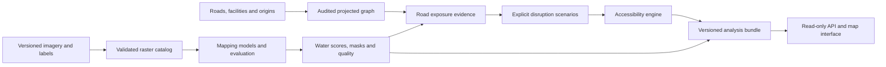

# Flood Impact and Infrastructure Accessibility

A planned geospatial research application that maps observed surface water from satellite imagery and examines how uncertain flood-related road disruption could change access to essential services.

**Status: M2 canonical pilot complete locally.** The 446-chip source catalog has an event-safe split, and three real radar/optical/label trios have been converted into validated canonical tiles with local Spain vector and visual QA outputs. Source and derived data are ignored by Git and absent from a clean clone. No model has been trained, no hospital-accessibility case has been validated, and no operational application is included. The executable example is a deliberately synthetic network calculation.

## Purpose

Flood extent is useful, but planners also need to understand possible consequences: disconnected communities, exposed road links, and loss of access to hospitals. This project connects evaluated satellite mapping to transparent network scenarios, with uncertainty, provenance, and evidence available to the analyst.

The primary users are geospatial analysts, infrastructure researchers and emergency-planning researchers performing retrospective analysis. This is a professional portfolio and research demonstrator, not an emergency navigation or evacuation service.

## Objectives

1. Establish a reproducible radar/optical mapping benchmark with event-held-out evaluation.
2. Distinguish observed surface water, evidence of event inundation, permanent-water context and unknown pixels.
3. Compare simple mapping methods with compact neural and sensor-fusion candidates; evaluate a geospatial foundation-model branch only when input compatibility and hardware allow it.
4. Quantify mapping reliability and show how uncertainty changes infrastructure-access conclusions.
5. Build an auditable road graph and measure baseline versus disruption-scenario access to hospitals for explicit origin locations.
6. Deliver a usable map application with evidence, scenario controls, exports and reproducible evaluation.

## Scope

Two connected workstreams are required. The **benchmark** uses Sen1Floods11 to evaluate water segmentation. The **case study** uses a geographically coherent event, road network, essential-service inventory and origins to demonstrate accessibility analysis. Benchmark chips from other countries cannot supply a Queensland inundation map.

Queensland was the preferred case-study location. The M1 audit found Brisbane 2022 unsuitable for a validated peak-time radar/optical fusion claim with current evidence. The 2019 Orihuela/Dolores area in Spain is the conditional first case pilot because benchmark imagery intersects an independently interpreted Copernicus flood product. A wider navigable road network to hospitals is still a gate before accessibility analysis. Queensland may remain a clearly dated, unvalidated scenario illustration. Never invent local ground truth.

Start with hospitals and a small, documented set of settlement/origin points. Population-weighted impact, multiple service types, real-time refresh and larger regions are later extensions. Baseline road travel costs are estimated static costs, not observed flood travel times. Inference must show acquisition dates and unavailable areas.

Excluded from the core scope: flood forecasting, water-depth/velocity estimation, autonomous evacuation advice, certified safe routes, facility-capacity modelling, causal claims about deaths prevented, and live emergency deployment.

## Proposed method

- Audit imagery, labels, acquisition offsets, licences and split leakage.
- Compare radar thresholding and optical water indices with radar-only and optical-only U-Net baselines.
- Evaluate radar/optical fusion under optical degradation or missingness.
- Optionally adapt a compatible optical Prithvi-EO-2.0 model; radar needs a separate branch and all preprocessing must be documented.
- Calibrate scores using held-out events and measure reliability by event and image quality.
- Intersect water evidence with road geometry, preserving unknown and ambiguous exposures.
- Apply explicit disruption assumptions to a topology-audited graph and measure connectivity and service-access changes.

## System architecture



Planned implementation: Python raster/geospatial pipeline, PyTorch model experiments, Parquet/GeoParquet and cloud-optimised rasters, a small graph engine, then FastAPI and a TypeScript map interface. Start locally and add services only when a requirement warrants them.

## Run the included scaffold

Python 3.12 is the tested local environment for this scaffold. Select a Python 3.12 executable and confirm `python --version` before creating the environment. CI runs the full M2 pipeline on Python 3.12 and checks the standard-library core separately on Python 3.11. M2's raster/vector/QA packages are pinned in `requirements/m2-pipeline.lock` and require Python 3.12 or newer; model/training dependencies remain gated.

```powershell
python -m venv .venv
.\.venv\Scripts\python.exe -m pip install -e .
.\.venv\Scripts\python.exe -m flood_access status
.\.venv\Scripts\python.exe -m flood_access demo --scenario conservative
.\.venv\Scripts\python.exe -m pip install -r requirements/m2-pipeline.lock
.\.venv\Scripts\python.exe -m unittest discover -s tests -v
```

`demo` returns synthetic shortest-path costs and disconnected origins. Its distances, road states and facility are invented fixtures. It performs no satellite processing and makes no geographic claim. Installation needs access to the Python package index for the build backend; use `PYTHONPATH=src` in your shell to run the source directly if an offline environment is required.

For the full test suite, install `requirements/m2-pipeline.lock` in the same environment. Local real-data work then runs `python scripts/build_m2_pilot.py` from the repository root. It requires the ignored pilot source files; a clean clone can still run the synthetic CLI commands above. `status` reports whether the local pilot files are present. [Reproducibility](docs/REPRODUCIBILITY.md) gives build, integrity and visual checks. The source audit, licence limits and case decision are in [Dataset feasibility](docs/DATASETS.md).

## Documentation

- [Detailed scope and success criteria](docs/SCOPE.md)
- [Architecture and components](docs/ARCHITECTURE.md)
- [Dataset sources and feasibility gates](docs/DATASETS.md)
- [Data contracts](docs/DATA_CONTRACT.md)
- [Evaluation protocol](docs/EVALUATION.md)
- [Responsible interpretation](docs/RESPONSIBLE_USE.md)
- [Reproducibility](docs/REPRODUCIBILITY.md)
- [Research protocol draft](docs/RESEARCH_PROTOCOL.md)
- [Publishing and attribution](docs/PUBLISHING.md)

Public documentation remains self-contained when internal execution notes are omitted from Git. Data and pretrained weights have their own terms; see the dataset registry. No software licence is selected in this starter; choose one before an open-source release.
